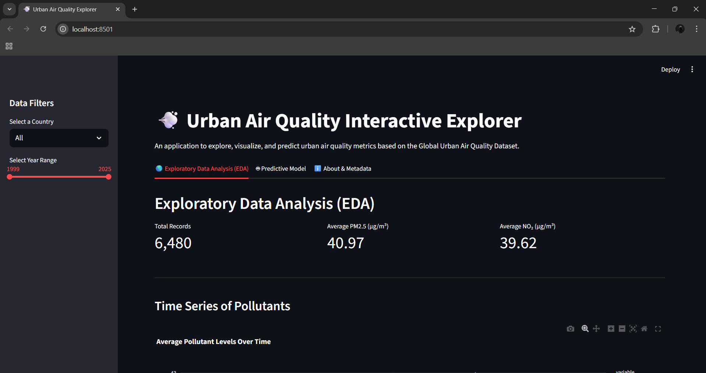
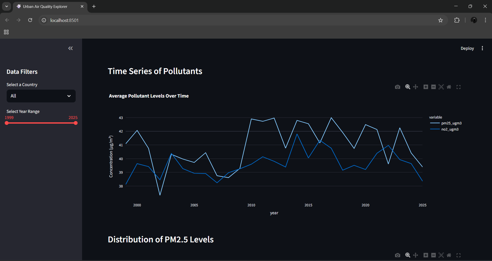
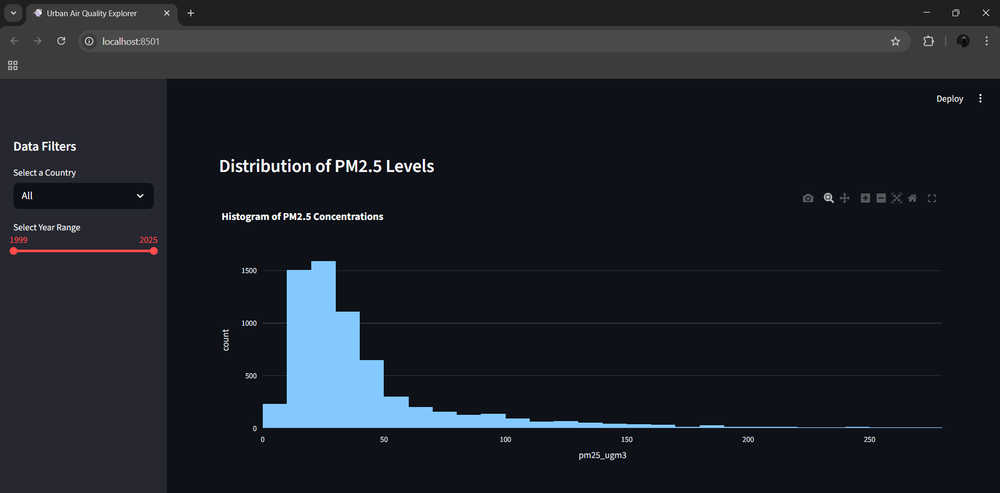
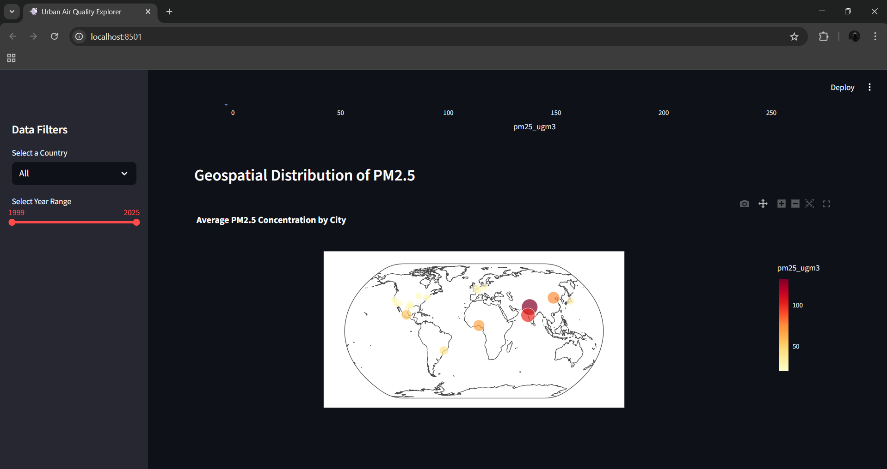
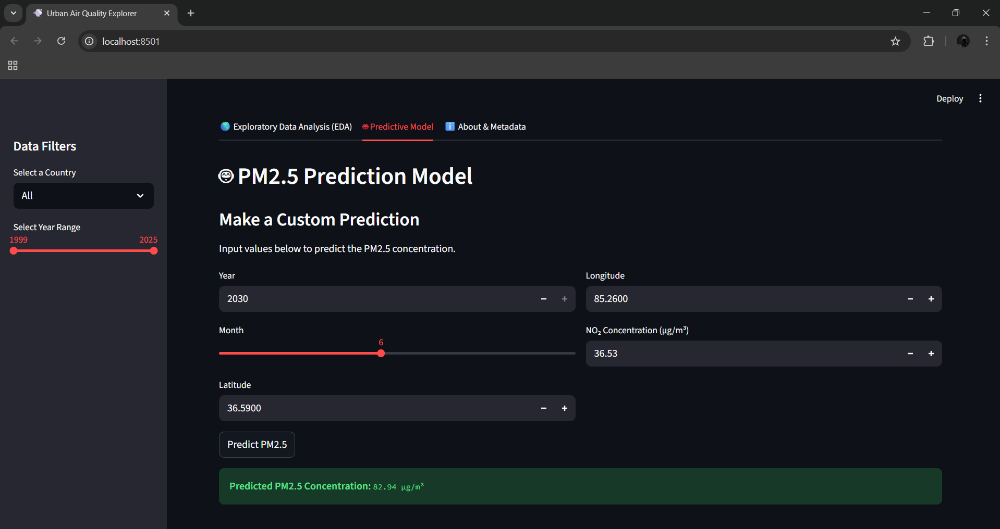
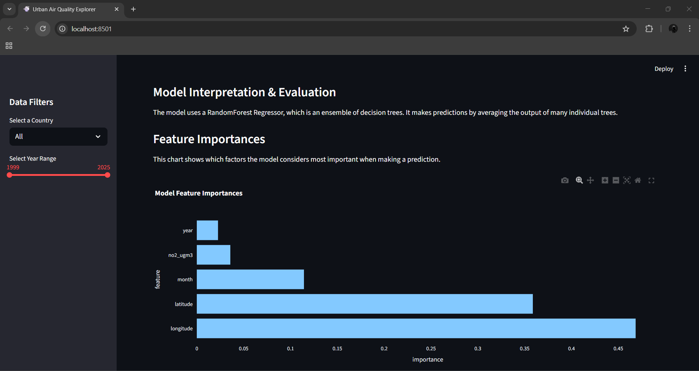
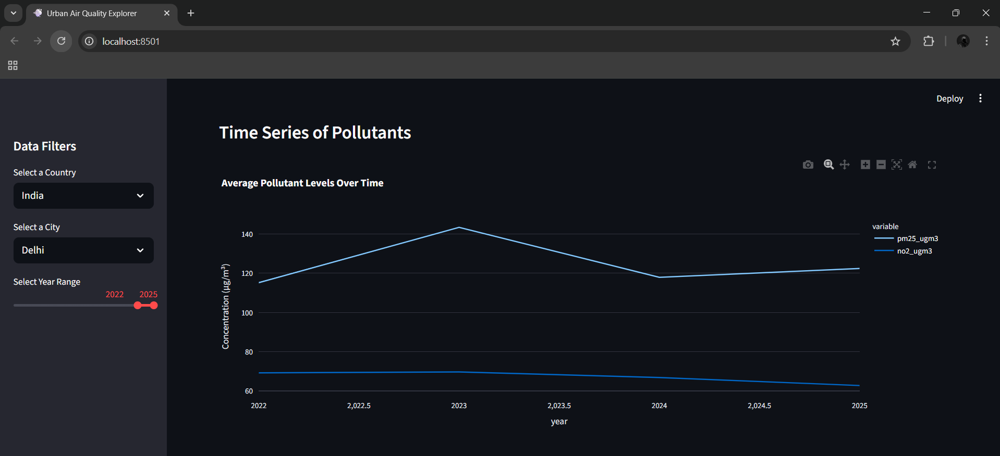

# 💨 Urban Air Quality Explorer & Prediction App

A comprehensive web application built with Streamlit for the interactive analysis, visualization, and prediction of global urban air quality metrics (PM2.5).

## 📚 Table of Contents

1.  Project Goal
    
2.  Dataset Details
    
3.  How to Run the Application
    
4.  File Structure
    
5.  EDA Summary: Key Findings
    
6.  Predictive Model Details
    
7.  Design Decisions & Assumptions
    
8.  Application Screenshots
    
9.  Contact & Authorship
    

## Project Goal

The objective of this project is to build an interactive tool for exploring the **Urban Air Quality and Climate Dataset**. The application demonstrates a complete data science workflow, including:

-   **Data Ingestion**: Loading and parsing the primary CSV dataset and its accompanying JSON metadata.
    
-   **Exploratory Data Analysis (EDA)**: Providing interactive visualizations to uncover trends and patterns.
    
-   **Data Preprocessing**: Implementing a strategy for handling missing data before modeling.
    
-   **Predictive Modeling**: Training a machine learning model to predict PM2.5 concentrations based on a set of features.
    

## Dataset Details

-   **Primary Data File**: `air_quality_global.csv`
    
-   **Metadata File**: `metadata.json` (contains details on data sources, quality, and usage recommendations)
    
-   **Total Records**: 17,813
    
-   **Columns**: 10
    
-   **License**: Creative Commons CC0 1.0 (Public Domain)
    

The `metadata.json` file was used to understand the dataset's structure, identify key features, and acknowledge data quality notes which guided the preprocessing strategy.

## How to Run the Application

Follow these steps to set up and run the project locally.

### Prerequisites

-   Python 3.8 or newer
    
-   pip (Python package installer)
    

### Step 1: Initial Setup

bash

```
# Navigate to the project folder
cd AirQualityAnalysis

# Install dependencies
pip install -r requirements.txt

```

### Step 2: Train the Predictive Model

bash

```
python train_model.py

```

This script preprocesses the data, trains a `RandomForestRegressor`, and saves the final model artifact to the `/models` directory.

### Step 3: Launch the Streamlit Application

bash

```
streamlit run app/app.py

```

The application will automatically open in your web browser, typically at http://localhost:8501.

## File Structure
```
AirQualityAnalysis/
│
├── app/
│   └── app.py                  # Main Streamlit application code
├── notebooks/
│   └── EDA_and_Modeling.ipynb  # Jupyter notebook for exploration & prototyping
├── data/
│   ├── air_quality_global.csv  # The primary dataset
│   └── metadata.json           # Dataset documentation
├── models/
│   └── pm25_predictor.joblib   # Saved (trained) model artifact
├── assets/
│   └── (Screenshots for this README)
│
├── requirements.txt            # Python package dependencies
├── README.md                   # This documentation file
└── train_model.py              # Script to preprocess data and train the model

```

## EDA Summary: Key Findings

-   **Geographic Hotspots**: Cities in South Asia and Africa exhibit significantly higher average PM2.5 concentrations.
    
-   **Strong Pollutant Correlation**: PM2.5 and NO₂ levels show a strong positive correlation, indicating common sources like traffic and industry.
    
-   **Seasonal Variations**: Higher PM2.5 levels are observed during colder months, likely due to meteorological factors and heating-related emissions.
    

## Predictive Model Details

-   **Algorithm**: `RandomForestRegressor` (Scikit-learn)
    
-   **Hyperparameter Tuning**: `GridSearchCV` was used to optimize:
    
    -   `n_estimators`
        
    -   `max_depth`
        
    -   `min_samples_leaf`
        
-   **Final Parameters**:
    

python

```
{'max_depth': 20, 'min_samples_leaf': 5, 'n_estimators': 100}

```

-   **Evaluation Metrics**:
    
    -   **R² Score**: 0.85
        
    -   **Mean Squared Error (MSE)**: 35.61
        

## Design Decisions & Assumptions

-   **Missing Value Strategy**: Median imputation for numerical features.
    
-   **Feature Selection**: Used `latitude`, `longitude`, `year`, `month`, and `no2_ugm3` as predictors.
    
-   **Reproducibility**: Set `random_state=42` for consistent results.
    

## Application Screenshots















## Contact & Authorship

-   **Name**: **Mudit Gupta**

-   **Email**: <muditg782005@gmail.com>
